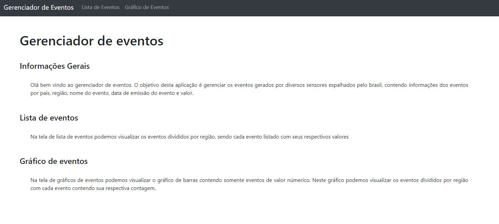
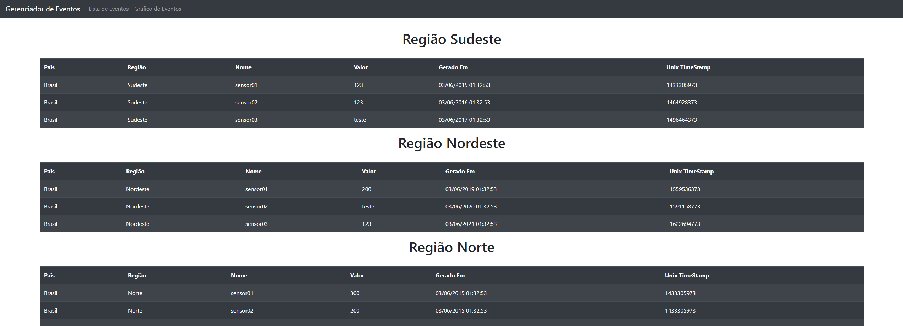
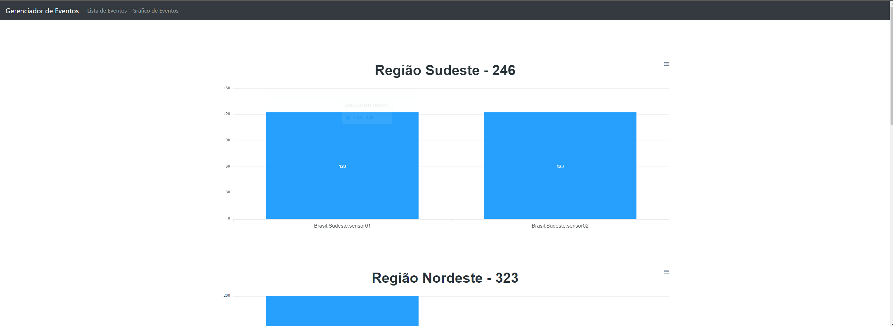
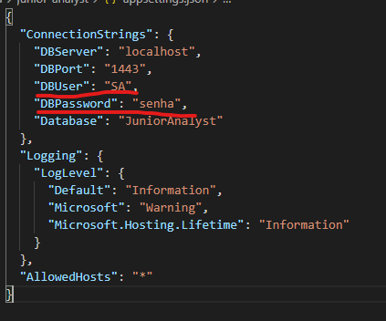

# Documentação

## 1. Solução

- Para solução do problema de gerenciamento de eventos gerados por sensores, foi desenvolvido um servidor que irá receber requisições possibilitando listagem e cadastro de eventos em uma base de dados relacional. Para melhor visualização de dados também foi desenvolvido um pequeno portal que possibilita uma melhor visualização dos dados atráves de tabelas e gráficos.







## 2. Tecnologias

- Para as tecnologias, foi escolhido o **sql server** como banco de dados e o **dotnet core 3.1** para desenvolvimento da api. No frontend foi utilizado o framework **React JS**. Para o teste foi utilizado o pacote do **xunit**, facilitando assim os testes unitários. 

## 3. Estrutura dos projetos

### 3.1 Backend

- Para o backend, a estrutura do projeto foi organizada em cima de 4 modelos principais, sendo eles Application, Domain, Repository e Service.

- No modulo **Application**, temos os controllers, que irão representar as possiveis ações que poderão ser chamadas para que exista a interação do usuário com o sistema. Esse modulo irá se comunicar com o **Service**.

- No modulo **Service** temos as regras de negócio. A idéia do service é que sejam feitas as validações dos dados, garantindo que os dados sejam inseridos de forma consistente no **Repository** e que sejam retornadas as mensagens corretas no retorno para o usuário.

- No modulo **Repository** temos as intruções que irão estar em contato direto com os dados que possuem seus modelos definidos no **Domain**. Este modulo irá conter as intruções de gerenciamento do banco, sendo que a idéia é que os dados estejam consistentes ao chegarem nessa camada.

- No modulo **Domain** temos a representação dos objetos de negócio modelados para o código. Neste modulo podemos encontras as classes, mappers, interfaces e entidades, estruturas essas que irão facilitar o mapeamento dos objetos reais para o código. 

### 3.2 Frontend

- Para o frontend foi utilizada uma estrutura simples de organização baseada em componentes, sendo que cada componente do react foi colocado em um diretório especifico, facilitando assim a procura e gerenciamento do codigo fonte para futuras alterações.

## 4. Instruções de uso

- Abaixo serão listadas as formas de excução do projeto

### 4.1 Execução Manual

- O projeto pode ser executado de forma manual, executando cada parte. 

- Inicialmente deverá ser executada a api com o comando `dotnet run` dentro da pasta **backend\junior-analyst**. É importante especificar que para execução correta da api é necessário que o serviço do sql server esteja rodando localmente e é necessário especificar o usuário e senha do sql sever localmente instalado. O arquivo de configuração será o `appsettings.json` localizado no diretorio **backend\junior-analyst**.

- Posteriormente será necessário somente executar o projeto do frontend, executando inicialmente o comando `npm install` dentro da pasta **junior-analyst\frontend** para instalar as dependencias do node necessárias para a execuçã do projeto. Após isso será necessário somente executar o comando `npm start` dentro da pasta **junior-analyst\frontend** para executar o projeto, sendo que por default irá abrir no endereço `localhost:3000` ou  `localhost:3001`(para execução com docker será 3001). Para execução do frontend será necessário ter instalado localmente o `node`.



### 4.2 Execução com Docker

- Para execução do programa com o docker, somente será ter baixado o docker e executar o comando ``docker-compose up`` na raiz do projeto. Executando o comando do docker-compose ele ja irá se encarregar de subir os três containers(banco, api e frontend) e executar. Em relação as credenciais de banco, as mesmas ja são passadas corretamente pelo arquivo do docker compose.

- **Obs:** Pode acontecer do container da api não rodar de primeira e ocorrer erro pois o serviço interno do container do sql server poderá não ter iniciado, algo que mesmo com o ``depends_on`` pode ocorrer. Nesses casos não precisa fazer nada, somente é necessário esperar todos os containers executarem, pois mesmo que ocorra erro, o ``restart: on-failure:10 `` será encarregado de tentar executar novamente quando ocorrer falha.

## 5. Rotas da API

- Abaixo seguem as rotas criadas para a api e suas descrições. A porta padrão da api será 5000, podendo alterar de máquina em máquina de acordo com os processos executados. Tanto via docker quanto execução direta, podem ser chamadas as rotas da api com o prefixo: **http://localhost:5000/api**. Portanto, para chamada das rotas abaixo será necessário colocar o prefixo(http://localhost:5000/api) seguido das especificações abaixo:

- /Evento: Método do tipo GET para listagem de todos os eventos cadastrados.

- /Evento: Método do tipo Post para cadastro de evento. Nessa rota será necessário passar no corpo da requisição o objeto de cadastro do evento. Abaixo segue um exemplo do objeto:

```json
{
   "timestamp": 1313313,
   "tag": "brasil.abril.sensor01",
   "valor" : "123"
}
```

- /Evento/{id}: Método do tipo GET que irá obter o evento de acordo com o id passado como parametro na url

- /Evento/GetNumeric: Método do tipo GET utilizado para a listagem de todos os eventos que foram cadastrados com valor númerico.

- Link para documentação da api no postman: https://documenter.getpostman.com/view/12304172/TzRPiUVE

- **Obs:** Ao executar a api pela primeira vez, será realizada uma primeira carga e serão cadastrados alguns eventos de exemplo. Para cadastro dos proximos eventos será necessário chamar a rota da api de cadastro.

## 6. Testes

- Para os testes foi utilizado o xunit, sendo realizados testes unitários com dados mockados e testados os métodos do serviço de eventos.

## 7. Futuras implementações

- Dentre futuras implementações, seria interessante a criação de uma tela de cadastro para os eventos e o uso de outros tipos de representações além do gráfico de barras. 